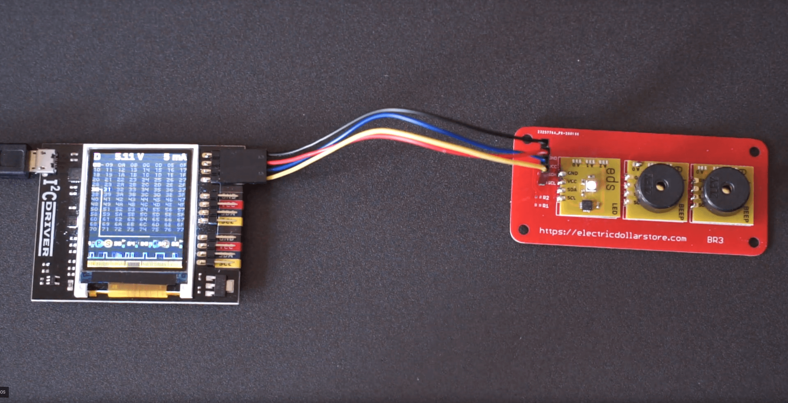

# I2CDriver Music Player

This project plays simply music notes using buzzers and the I2CDriver from ExCamera Labs. It supports play two tracks simultaneously. You can find a YouTube video demo here: https://www.youtube.com/embed/oBWIhKuSIXk



Current supported songs:

- supermario.py: the Super Mario Bro. theme song
- march_of_steel_torrent.py: the March of Steel Torrent (Chinese: 钢铁洪流进行曲)

You can extent this code by adding more songs using a separate python script in the /music folder.


## Notes on I2CDriver

To speedup I2CDriver, use setserial to change the USB port speed:

```
$ setserial /dev/ttyUSB0 low_latency
```

This sets the USB latency to its minimal 1ms and can increase the speed of two-way traffic by up to 10X.

To find more about I2CDriver: https://i2cdriver.com/


## Limitation
The two tracks are not totally separated, and they can only use same tempos. Hence the second track is only ideal for playing chords.
